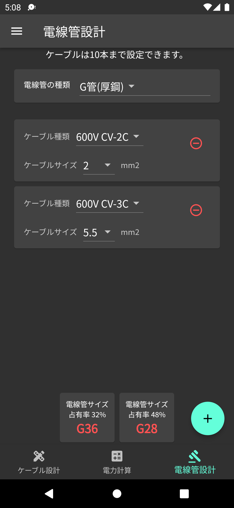

# 電気設備計算アシスタント

## アプリ概要

電気設備設計業務や作業現場でケーブルサイズ、電圧降下、電力、電線管サイズを計算したいときに、簡単に計算するためのツールです。

本アプリの利用には[利用規約](../common/terms.md)と[プライバシーポリシー](../common/privacypolicy.md)に同意したものとします。

## アプリの機能

アプリの機能について紹介します。

- 電気容量、電圧、力率からケーブルを選定
- 選定したケーブルとケーブルの長さから電圧降下と電力損失を計算
- ケーブルは4種類の中から選定可能
- 電圧、電流から各電力値(皮相、有効、無効)を計算
- 力率からsinφを計算
- 選択されたケーブルから電線管を選定
- 電線管は4種類の中から選定可能
- 計算結果はアプリ内で一時的に保存
- ライトモードとダークモードの選択が可能

屋外使用時はライトモード、比較的暗い場所での使用時はダークモードの使用をおすすめします。

なお、広告は一時停止(再開次期未定)しています。

## 配信先

`Androidアプリ`と`webアプリ`に対応しています。
`webアプリ`については、テスト用ですので、サービスが停止される可能性があります。

[web](https://ewacdj-3936b.web.app/)

## 計算方法

アプリで使用している計算方法や条件については、[電気設備計算アシスタントの計算手法ページ](method.md)にまとめています。

## 使い方

アプリの使い方は[電気設備計算アシスタントの使い方ページ](howtouse.md)にまとめています。

## アプリの権限について

本アプリの権限は広告のために使用されています。

## 不具合や改善要望について

不具合報告、改善要望、ご質問等は[お問い合わせフォーム](https://forms.gle/6G7RaQP7uG7ufKSP8)からお問い合わせください。
また、アプリの評価ページでの報告も可能です。

## 今後の開発について

以下に予定されているサービス以外で追加してほしい機能があれば、[お問い合わせフォーム](https://forms.gle/6G7RaQP7uG7ufKSP8)よりお願いします。

- オームの法則の計算機能
- 設備容量計算機能(負荷率、需要率等)
- 合成抵抗計算
- 電動機の遮断器サーマル選定機能
- 短絡電流計算

## 最終更新日

2022/5/19

[◁ようこそのページへ](../index.md)