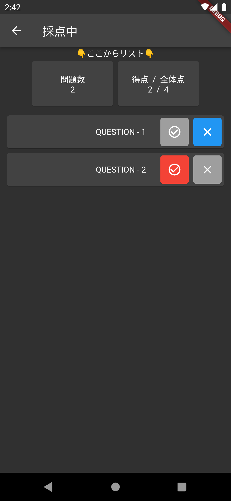

# 採点計算SCCOアプリ

## アプリ概要

試験の解答合わせを行ったあと、点数の計算するためのツールです！
学校の先生だけではなく、生徒自身が自己採点したいときや、資格試験の過去問を解いて点数を計算したい社会人の方にもご利用いただけます。

【主な機能】

- 最大5件のテスト登録
- 最大100問までのテストの
- 最大50名までのメンバー(生徒等)の登録

本アプリの利用には[利用規約](../common/terms.md)と[プライバシーポリシー](privacypolicy.md)に同意したものとします。

## アプリの配信先

製作中です。

## 使い方

テスト名の設定→設問設定→メンバー設定の順に設定してください。
設定後、リストからテストを選択し、メンバーを選んで採点結果を入力してください。

※画面イメージは変更される可能性があります。

## アプリの権限について

本アプリの権限は以下の目的のために使用されます。

- 計算結果を保存するため
- 広告表示のため

それ以外の用途では情報の収集や共有をしておりません。

## 不具合や改善要望について

[お問い合わせフォーム](https://forms.gle/p31kWviNvKnKRyDfA)を設置しております。

また、アプリの評価ページからもご報告できます。

## 今後の開発について

- 質問の名称変更(次期アップデートで実装予定)
- メンバーの名称変更(次期アップデートで実装予定)
- テスト名の変更(次期アップデートで実装予定)
- エクスポート機能
- 大問(質問グループ)機能
- クラウド連携機能

[◁ようこそのページへ](../index.md)
